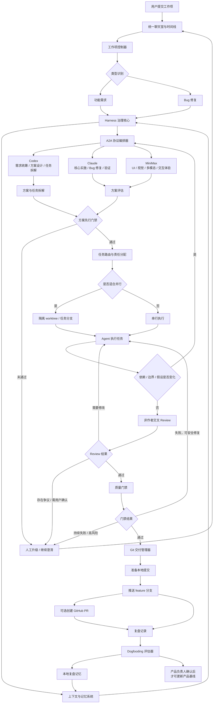

# Clowder AI 系统架构设计

> 状态：当前基线
> 所属：架构
> 规则效力：系统架构约束与设计解释
> 维护角色：系统架构师


## 摘要

Clowder AI 首版架构以 Harness 作为治理核心，围绕本机、单用户、单项目、三 Agent 协作工作流构建。系统不是三个独立聊天 Agent 的并列输出，而是一个受工作项状态机、A2A 协议、权限护栏、交叉 Review、质量门禁、人工升级和复盘记忆共同约束的协作系统。

首版架构目标是让功能需求和 Bug 修复工作项从录入到交付全程可见、可追踪、可治理、可恢复，并支持在边界清晰时由 Codex、Claude、MiniMax 通过隔离 worktree 并行推进。

本文中的数据与状态模型均为逻辑模型，不代表最终物理存储设计或数据库 schema。

核心原则：

- 方案先行，未完成澄清、方案评估和任务拆解前不得开发。
- A2A 覆盖澄清、设计、拆解、执行同步、Review、验证和复盘全流程。
- 所有开发产物必须经过非作者 Review。
- 并行开发必须通过独立 worktree 或等效隔离机制治理。
- Harness 负责上下文、权限、状态、工具、门禁、升级、观测和反馈回路。
- Dogfooding 结果只能提出改进建议，产品规则变更必须由产品负责人确认。

## 核心逻辑设计图



## 架构目标

1. 保证工作项从录入到交付全程可见、可追踪、可恢复。
2. 防止 Agent 在需求不清、方案未评估、Review 缺失时直接执行。
3. 支持 Codex、Claude、MiniMax 在清晰任务边界下并行协作。
4. 通过 worktree 隔离降低并行开发时的文件覆盖风险。
5. 通过交叉 Review、质量门禁和人工升级控制交付风险。
6. 将 Dogfooding 复盘沉淀为本地记忆，并反馈到后续任务。
7. 优先保证可追踪性和治理能力，再逐步提高自动化程度。

## 主要组件

### 统一聊天室与时间线

统一聊天室是用户、Codex、Claude、MiniMax 以及 Harness 状态的共享可见空间。它展示：

- 用户消息。
- Agent 消息。
- A2A 交互。
- 决策与分歧。
- 工作项状态变化。
- Review 结果。
- 质量门禁结果。
- Git 交付结果。
- 复盘记录。

时间线不只是聊天记录，还承担审计和协作追踪职责。所有关键状态变化都必须进入时间线。

### 工作项控制器

工作项控制器负责维护工作项生命周期、状态机、任务拆解、阻塞项和交付状态。它是用户请求进入系统后的主流程入口。

职责：

- 创建和更新工作项。
- 识别工作项类型。
- 管理工作项状态机。
- 绑定任务、Agent、Review 方和验收标准。
- 判断当前阶段是否允许进入下一阶段。
- 将阻塞、失败和升级事件暴露给 Harness 和时间线。

### A2A 协议编排器

A2A 协议编排器负责 Codex、Claude、MiniMax 之间的定向交互。它确保 A2A 不只出现在 Review 阶段，而是覆盖完整工作流。

职责：

- 发起澄清请求。
- 记录需求质询。
- 组织方案评估。
- 收集任务拆解反馈。
- 管理任务交接。
- 记录执行同步。
- 触发 Review 请求。
- 处理修改要求。
- 组织验证请求。
- 暴露分歧升级。
- 记录复盘反馈。

### Harness 治理核心

Harness 是治理层，不是简单工具调用器。它负责在 Agent 行为外围实施上下文管理、记忆管理、权限管理、工具沙箱、状态护栏、Loop 控制、人工升级和安全约束。

职责：

- 为 Agent 提供当前任务所需上下文。
- 阻止上下文缺失或陈旧时继续执行高风险动作。
- 判断当前状态允许的下一步动作。
- 强制执行方案先行、非作者 Review 和质量门禁。
- 控制工具和工作区访问范围。
- 控制 Agent 重试、Review 循环和停止条件。
- 对高风险动作触发人工确认。
- 记录观测数据和复盘输入。

### Agent 适配层

Agent 适配层封装 Codex、Claude、MiniMax 的角色能力、任务输入、输出规范和权限边界。

角色分工：

- Codex：需求统筹、意图识别、方案设计、任务拆解、整体推进，也可承担开发任务，但不能自审。
- Claude：核心实施、代码修改、Bug 修复、运行检查和修复验证，不能自审。
- MiniMax：UI、视觉、多模态、语音、视频、图片和交互体验相关设计或 Review。相关任务中 MiniMax 必须参与方案或 Review。

### 上下文与记忆系统

上下文与记忆系统维护当前工作项上下文、历史决策、本地复盘记忆、Review 发现和失败模式。

上下文用于当前任务推进。记忆用于后续任务参考，但不能覆盖当前用户指令或明确产品规则。

### 工作区与产物管理器

工作区与产物管理器负责并行开发场景下的隔离工作区治理。

职责：

- 为任务分配 branch 或 worktree。
- 绑定 Agent、任务和工作区。
- 跟踪每个工作区的变更。
- 记录合并顺序。
- 检测文件冲突和潜在语义冲突。
- 管理工作区清理和归档状态。

### Review 与质量门禁引擎

Review 与质量门禁引擎负责强制执行交叉 Review 和验证检查。

职责：

- 阻止作者自审放行。
- 强制 UI、视觉、多模态和交互类任务由 MiniMax 参与方案或 Review。
- 记录 Review 发现、结论和修复状态。
- 执行质量门禁。
- 暴露失败结果。
- 允许一次安全自动修复。
- 在持续失败时进入阻塞或触发用户确认。

### Git 交付管理器

Git 交付管理器负责本地提交准备、feature 分支推送和可选 GitHub PR 创建。

职责：

- 在 Review 和质量门禁通过后准备本地提交。
- 推送 feature 分支到 `git@github-lumen:lumen121/clowder-ai.git`。
- 在凭证允许时可选创建 GitHub PR。
- 禁止默认直接推送到 `main`。
- 禁止默认合并到 `main`。
- 禁止自动合并 PR。

### Dogfooding 评估器

Dogfooding 评估器负责记录真实 Clowder AI 自身开发任务中的协作数据，并将结果转化为复盘事实、解释、改进建议和技术执行建议。

职责：

- 记录 Dogfooding 工作项。
- 统计 A2A、Review、返工、门禁、耗时和失败原因。
- 生成复盘结论。
- 提出流程改进建议。
- 记录技术执行建议。
- 区分事实、Agent 解释、改进建议、技术执行建议和已确认产品规则。

## 数据与状态模型

### WorkItem

工作项实体记录用户请求从录入到交付的完整状态。

字段：

- `id`
- `type`：功能需求或 Bug 修复。
- `goal`
- `scope`
- `status`
- `assumptions`
- `ambiguities`
- `risks`
- `solution`
- `tasks`
- `disagreements`
- `escalations`
- `review_status`
- `quality_status`
- `delivery_status`
- `retrospective_status`

### Task

任务实体记录拆解后的可执行单元。

字段：

- `id`
- `work_item_id`
- `owner_agent`
- `collaborators`
- `boundary`
- `dependencies`
- `expected_artifacts`
- `reviewer_agent`
- `acceptance_criteria`
- `parallelizable`
- `workspace_id`
- `status`

### A2AEvent

A2A 事件记录关键 Agent 间交互。

字段：

- `id`
- `from_agent`
- `to_agent`
- `work_item_id`
- `task_id`
- `purpose`
- `context`
- `claim_or_request`
- `response`
- `conclusion`
- `next_action`
- `requires_user_intervention`

### ReviewRecord

Review 记录描述非作者审核结果。

字段：

- `id`
- `work_item_id`
- `task_id`
- `author_agent`
- `reviewer_agent`
- `scope`
- `findings`
- `result`
- `required_fixes`
- `resolved`

Review 结果只能是：

- `approved`
- `changes_requested`
- `disputed`
- `user_confirmation_required`

### QualityGateRun

质量门禁记录检查与验证结果。

字段：

- `id`
- `work_item_id`
- `task_id`
- `gate_name`
- `validation_method`
- `result`
- `failure_reason`
- `safe_fix_attempted`
- `final_status`

### WorkspaceRecord

工作区记录用于跟踪并行 worktree 或等效隔离区。

字段：

- `id`
- `agent`
- `task_id`
- `branch`
- `worktree_path`
- `changed_files`
- `merge_order`
- `conflict_status`
- `cleanup_status`

### EscalationRecord

升级记录用于所有必须请求用户确认的情况。

字段：

- `id`
- `work_item_id`
- `trigger_rule`
- `what_happened`
- `blocked_gate`
- `options`
- `risks`
- `recommended_next_step`
- `user_decision`

### RetrospectiveMemory

复盘记忆记录可被后续任务检索的经验。

字段：

- `id`
- `work_item_id`
- `effective_patterns`
- `failure_causes`
- `review_findings`
- `quality_gate_results`
- `user_intervention_reasons`
- `process_improvement_suggestions`
- `technical_execution_suggestions`
- `confirmed_as_baseline`

## 工作项状态机

```text
needs_clarification
  -> solution_review
  -> ready_for_development
  -> in_development
  -> pending_review
  -> needs_fix
  -> in_development
  -> pending_verification
  -> ready_to_commit
  -> pushed
  -> completed
```

`blocked` 可以由任意阶段进入。

进入 `blocked` 的典型条件：

- 重大需求歧义阻塞推进。
- Agent 无法解决重大分歧。
- 高风险 Bug 缺少验证路径。
- 质量门禁持续失败且无法安全修复。
- 并行 worktree 冲突无法安全解决。
- 用户请求部署、合并主干、直接推送主干或绕过门禁。
- 需要人工确认但尚未获得确认。

## 核心流程

### 功能需求流程

1. 用户提交功能需求。
2. Codex 初步识别工作项类型。
3. Claude 和 MiniMax 可提出类型质疑、范围问题或风险提示。
4. Harness 判断是否存在阻塞性歧义。
5. Codex 形成方案和任务拆解。
6. Claude 和 MiniMax 评估方案、风险、可测试性和任务边界。
7. Harness 检查开发门禁。
8. 任务按边界串行或并行执行。
9. 作者请求非作者 Review。
10. Review 通过后执行质量门禁。
11. 门禁通过后准备本地提交。
12. 推送 feature 分支。
13. 可选创建 GitHub PR。
14. 记录复盘记忆。

### Bug 修复流程

1. 用户提交 Bug。
2. Codex 记录现象、影响范围和可用复现信息。
3. Claude 评估可能原因和验证路径。
4. MiniMax 在 UI、视觉或交互相关 Bug 中参与方案或 Review。
5. 如果复现信息不完整但可以基于假设推进，系统记录假设、风险和验证路径。
6. 如果高风险 Bug 缺少验证路径，Harness 升级给用户。
7. 方案和任务拆解通过评估后进入开发。
8. 作者完成修复后请求非作者 Review。
9. 执行回归验证和质量门禁。
10. 门禁通过后进入交付流程。
11. 记录复盘记忆。

### A2A 全流程覆盖

A2A 必须覆盖以下阶段：

- 类型识别：Codex 提出类型，其他 Agent 可质疑。
- 需求澄清：Agent 识别缺失信息和假设。
- 方案设计：Codex 主导，Claude 和 MiniMax 评估。
- 任务拆解：Agent 评估边界、依赖、产物和 Review 方。
- 执行同步：依赖、边界、共享区域或假设变化时同步。
- 交叉 Review：非作者 Agent 进行 Review。
- 验证：质量门禁失败或验证路径变化时同步。
- 复盘：记录有效做法、失败原因和流程改进建议。

## 方案先行门禁

进入开发前，Harness 必须确认：

- 工作项类型已识别。
- 需求歧义已解决，或已明确记录并可安全基于假设推进。
- 已形成方案。
- Agent 已评估方案。
- 没有未解决的内部分歧。
- 任务已定义负责人。
- 任务边界清晰。
- 依赖明确。
- 预期产物明确。
- Review 方明确。
- 验收标准明确。

任一条件不满足时，工作项不得进入 `ready_for_development`。

## 并行开发与 Worktree 隔离

### 并行准入条件

只有满足以下条件时，Agent 才能并行开发：

- 任务足够独立。
- 边界明确。
- 依赖明确。
- 产物可独立 Review。
- Review 方已指定。
- 合并顺序已知。
- 存在工作区隔离。
- 存在冲突检测和升级路径。

### 推荐分支与 Worktree 模型

```text
feature/<work-item-id>                  集成分支
feature/<work-item-id>/<task-id>-codex   Codex 任务分支
feature/<work-item-id>/<task-id>-claude  Claude 任务分支
feature/<work-item-id>/<task-id>-mm      MiniMax 任务分支
```

每个任务分支可以绑定一个独立 worktree。Harness 必须维护任务、Agent、分支和 worktree 的绑定关系。

### 冲突检测

合并前必须检测：

- 文件重叠。
- 核心模块重叠。
- API 或数据结构变更。
- 配置变更。
- 依赖变更。
- 语义冲突风险。

出现以下情况时，并行开发必须停止或降级为串行：

- 多个 Agent 修改同一核心文件或模块。
- 很可能出现语义冲突。
- 架构方向尚未确定。
- 需求仍有重大歧义。
- 执行过程中依赖发生变化。
- 合并顺序不再清晰。

## Review 与质量门禁

### Review 规则

- 作者不能成为自己产出的唯一 Review 方。
- Codex 产出必须由 Claude 或 MiniMax Review。
- Claude 产出必须由 Codex 或 MiniMax Review。
- MiniMax 的实现或产品影响型产出必须由 Codex 或 Claude Review。
- UI、视觉、多模态、语音、视频、图片或交互体验相关工作，MiniMax 必须参与方案或 Review。
- GitHub PR Review 不能替代内部 A2A Review。

### Review 结果

Review 结果只能是：

- 通过。
- 需要修改。
- 存在争议。
- 需要用户确认。

需要修改的问题必须在交付前解决。存在争议或需要用户确认的结果不得被静默放行。

### 质量门禁

质量门禁应在方案阶段定义，并在交付前执行。

质量门禁至少要求：

- 检查或验证步骤可见。
- 失败结果可见。
- 系统可以尝试一次安全自动修复。
- 持续失败会使工作项进入阻塞或需要用户确认状态。
- 系统不会隐藏或绕过失败检查。

具体门禁类型由任务性质决定，可以包括测试、构建、lint、类型检查、手动验证、复现验证、回归验证或 UI 可见检查。

## 安全与权限模型

### 权限分层

Harness 必须区分以下动作级别：

- 只读动作。
- 计划动作。
- 文件修改。
- 测试或检查执行。
- 提交准备。
- Feature 分支推送。
- PR 创建。
- 部署。
- 合并主干。

### 默认允许动作

在对应门禁满足时，系统可以执行：

- 读取项目上下文。
- 记录计划和 A2A 事件。
- 在任务绑定 worktree 内修改文件。
- 执行测试或检查。
- 准备本地提交。
- 推送 feature 分支。

### 必须人工确认的动作

系统必须停止并请求用户确认：

- 部署。
- 合并到 `main`。
- 直接推送到 `main`。
- 破坏性变更。
- 删除关键文件。
- 绕过失败门禁。
- 跳过 Review。
- Agent 分歧无法解决。
- 需求存在重大歧义。
- 高风险 Bug 缺少验证路径。
- 任何会永久改变外部状态且超出 feature 分支推送的动作。

### 禁止默认行为

系统不得默认执行：

- 直接推送到 `main`。
- 自动合并 PR。
- 自动部署。
- 隐藏失败结果。
- 跳过内部 A2A Review。
- 在需求和方案确认前开发。
- 未记录的文件修改。
- 用 GitHub PR Review 替代内部 A2A Review。

## 人工升级设计

升级给用户时必须包含：

- 发生了什么。
- 哪个规则或门禁阻塞了推进。
- 有哪些选项。
- 每个选项的风险。
- 推荐的下一步。

升级不是失败，而是治理系统在风险超出可自治范围时的正常出口。

## 失败恢复策略

### 上下文缺失

如果上下文缺失或陈旧会影响安全推进，Harness 必须阻止 Agent 继续执行，并要求补充上下文或升级用户。

### Agent Loop 失控

Harness 必须设置重试次数、Review 循环次数和停止条件。超过上限后进入 `blocked`，并记录失败原因。

### Review 争议

系统应记录争议双方观点，尝试通过 A2A 解决。若无法解决，升级给用户。

### 质量门禁失败

系统可以尝试一次安全自动修复。若持续失败，工作项进入 `blocked` 或请求用户确认风险。

### Worktree 冲突

发现文件冲突或高语义冲突风险时，停止合并，生成冲突报告，降级为串行处理或升级给用户。

### Git 推送失败

系统应保留本地提交状态，记录失败原因，并等待用户或环境修复。GitHub PR 创建失败不应影响内部交付状态，因为 PR 是可选能力。

## Git 提交、分支推送和可选 PR 流程

交付前必须满足：

- 内部 Review 已通过。
- 质量门禁已通过，或用户已明确确认风险。
- 工作项状态进入 `ready_to_commit`。

允许执行：

- 准备本地提交。
- 推送 feature 分支到 `git@github-lumen:lumen121/clowder-ai.git`。

可选执行：

- 在 GitHub CLI 登录态或 token 可用时创建 GitHub PR。

禁止默认执行：

- 推送到 `main`。
- 合并到 `main`。
- 自动合并 PR。
- 自动部署。

## 上下文与记忆设计

### 当前上下文

当前上下文包括：

- 用户请求。
- 工作项类型。
- 当前状态。
- 角色规则。
- 产品约束。
- 方案。
- 任务拆解。
- A2A 结论。
- Review 状态。
- 质量门禁状态。
- Git 交付状态。

Harness 必须确保 Agent 只接收与当前任务相关且足够完整的上下文。

### 本地复盘记忆

复盘记忆包括：

- 历史工作项结果。
- Review 发现。
- 失败原因。
- 有效协作模式。
- 用户介入原因。
- 质量门禁结果。
- 流程改进建议。

记忆可以影响后续工作中的澄清问题、路由策略、Review 重点和风险提示，但不能覆盖当前用户指令、产品文档或角色定义。

## 观测、指标和评估模型

系统至少记录：

- 工作项类型。
- 参与 Agent。
- A2A 交互次数和阶段分布。
- 决策和分歧。
- 人工介入次数。
- Review 发现数量和类型。
- 返工次数。
- 质量门禁结果。
- 从录入到方案确认的耗时。
- 从方案确认到 Review 的耗时。
- 从 Review 到交付的耗时。
- worktree 冲突次数。
- 失败原因。
- 交付结果。
- 是否使用了复盘记忆。

这些数据用于产品验收、Dogfooding 复盘和后续流程优化。

## Dogfooding 支撑设计

Dogfooding 使用与普通工作项相同的生命周期、A2A、Review、质量门禁和交付流程，但额外强化记录和复盘。

每个 Dogfooding 工作项必须记录：

- 工作项类型。
- 用户请求。
- 参与 Agent。
- 分配角色。
- 方案摘要。
- 任务拆分。
- A2A 交互。
- 分歧。
- 人工介入次数。
- Review 发现。
- 返工次数。
- 质量门禁结果。
- 交付结果。
- 从录入到交付的耗时。
- 失败原因。
- 复盘结论。
- 流程改进建议。

Dogfooding 反馈分为五类：

- 观察到的事实。
- Agent 的解释。
- 改进建议。
- 技术执行建议。
- 已确认的产品规则。

只有经过产品负责人确认的规则变更，才能成为新的产品基线。

## 产品验收标准到系统能力的映射

| 产品要求 | 架构能力 |
| --- | --- |
| 本机、单用户、单项目 | 本地工作项控制器、统一聊天室、Git 交付管理器 |
| 功能需求和 Bug 修复 | WorkItem 类型模型和对应流程 |
| 完整 A2A 工作流 | A2A 协议编排器、A2AEvent、时间线 |
| 方案先行 | 工作项状态机、开发门禁、Harness 护栏 |
| Agent 评估方案 | solution_review 状态和 A2A 方案评估记录 |
| 非作者 Review | Review 引擎和权限规则 |
| MiniMax 强制参与 | 任务路由规则和 Review 规则 |
| 并行开发控制 | Task 并行资格、WorkspaceRecord、合并顺序 |
| Worktree 隔离 | 工作区与产物管理器 |
| 冲突检测与升级 | 冲突检测、EscalationRecord、blocked 状态 |
| 质量门禁 | QualityGateRun 和门禁引擎 |
| 人工确认 | 升级策略和高风险动作拦截 |
| Feature 分支推送 | Git 交付管理器 |
| 禁止 main 和自动合并 | 安全与权限模型 |
| 本地复盘记忆 | RetrospectiveMemory |
| Dogfooding | Dogfooding 评估器和反馈回路 |

## 未决问题和假设

### 已采用假设

- 本地 Git、账号和 SSH key 已配置。
- 预期 Codex、Claude、MiniMax 的本地 CLI 调用条件已具备，但必须在 `T1 实现基线确认` 中验证。
- 首版只支持当前 `clowder-ai` 项目。
- 零阶段可由用户人工承担 Harness 职责。
- 系统会逐步自动化零阶段中由人工完成的任务。
- 首版优先保证可追踪性和治理能力，而不是最大化自治程度。

### 待后续技术设计确认

- 本地持久化与查询模型的具体方案。
- 具体测试、lint、构建和验证命令。
- 具体 UI 布局。
- Agent CLI 的调用协议和错误处理细节。
- GitHub PR 自动创建是否启用。
- 首个 Dogfooding 工作项选择。
